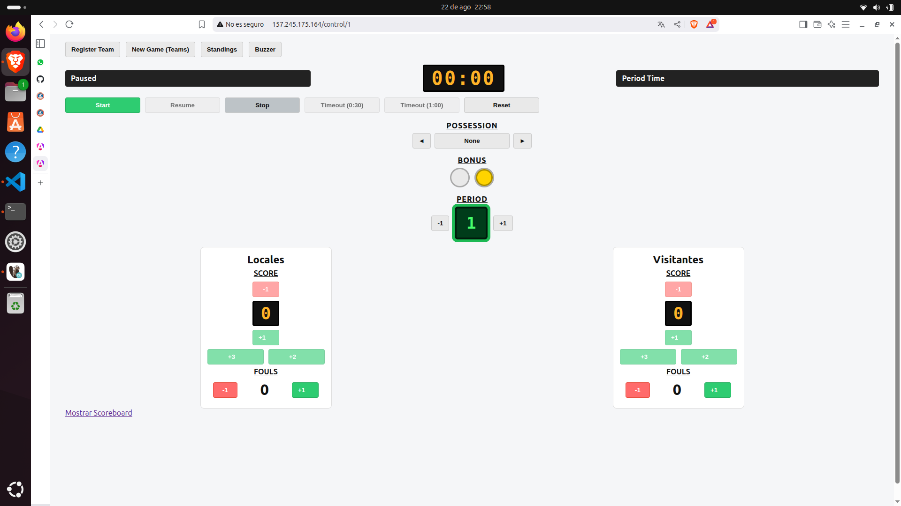
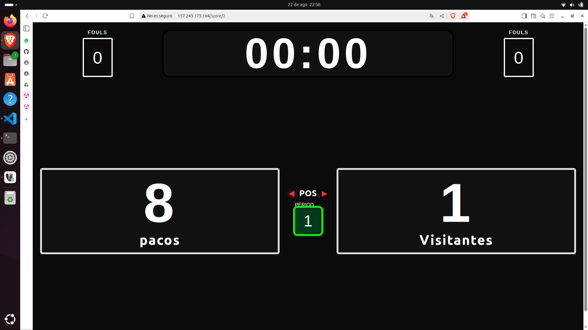

<h1><strong>PROYECTO 2 - DESARROLLO WEB</h1>

<h1><strong>MARCADOR DE BALONCESTO</h1>

[**https://proyectosdw.lat/**](https://proyectosdw.lat/ "proyecto")

# **Proyecto desarrollado por:**

---

#### Roberto Antonio Ramirez Gomez 7690-22-12700

#### Jean Klaus Castañeda Santos 7690-22-892

#### Jonathan Joel Chan Cuellar 7690-22-1805

---
# **Descripción de la aplicación web**
Esta aplicación nos permite controlar el marcador de partidos de baloncesto en tiempo real a través de un tablero de control administrado por roles y autenticación de usuarios.

## Arquitectura basada en microservicios
A partir de esta versión el monolito original se dividió en componentes independientes que colaboran entre sí:

| Servicio | Tecnología | Base de datos | Función |
| --- | --- | --- | --- |
| **Frontend** | Angular 17 + Nginx | — | Interfaz web para tablero de control y marcador público. |
| **tournament-service** | .NET 8 | SQL Server 2022 | Administración de partidos, cronómetro en tiempo real (SignalR), autenticación y roles. |
| **team-service** | Spring Boot (Java 17) | PostgreSQL 16 | Registro y mantenimiento de equipos, orquesta la creación/actualización de jugadores. |
| **player-service** | PHP 8.3 (Apache) | MySQL 8.4 | CRUD de jugadores y operaciones masivas por equipo. |

Los servicios se comunican mediante HTTP interno y se publican detrás de Nginx, que enruta `/api/matches` y rutas relacionadas al servicio de torneos, `/api/teams` al servicio de equipos y `/api/players` al servicio de jugadores.

## **Principales tecnologías utilizadas**
* [x] Angular + Angular Material
* [x] ASP.NET Core 8, Entity Framework Core y SignalR
* [x] Spring Boot 3 (REST + JPA + Actuator)
* [x] PHP 8.3 con PDO para MySQL
* [x] SQL Server 2022, PostgreSQL 16 y MySQL 8.4
* [x] Docker Compose para orquestación de contenedores
* [x] Nginx como reverse proxy y servidor estático
* [x] JWT para protección de endpoints y guardas en el frontend

## **Herramientas destacadas**
* Entity Framework Core y Spring Data JPA para persistencia.
* SignalR para sincronización en vivo del marcador.
* Sweet Alert para alertas interactivas.
* Docker + Docker Compose para empaquetar toda la solución.
* Nginx como reverse proxy interno.
* JWT y guards en Angular para control de acceso.

## **Enlaces para ver la documentación de la aplicación:**
[**Documentación Frontend**](https://github.com/rramirezg18/Proyecto-2-Desarrollo-Web/blob/main/documentacion%20del%20BACKEND.md "Backend")

[**Documentación Backend**](https://github.com/rramirezg18/Proyecto-2-Desarrollo-Web/blob/main/documentacion%20del%20FRONTED.md "Frontend")

[**Documentación Base de Datos**](https://github.com/rramirezg18/Proyecto-2-Desarrollo-Web/blob/main/DocumentacionBD.md "Base de Datos")

## **Enlaces para prueba de la aplicación:**
[**https://proyectosdw.lat/control**](https://proyectosdw.lat/control "control")

[**https://proyectosdw.lat/score**](https://proyectosdw.lat/score "score")

